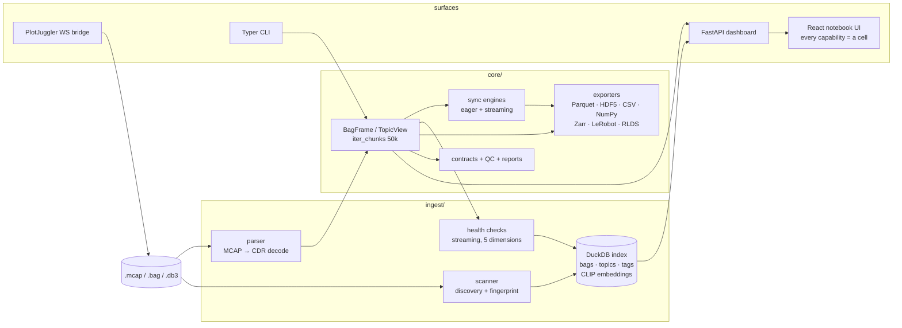

# Architecture

*How RosBag Resurrector is built, and why it's built that way. A 10-minute read
covering the system shape, the decisions that carry load, and what I'd do
differently. Last updated for v0.8.3 (August 2026).*

## The problem and its constraints

Robotics teams record terabytes of ROS 2 bags and analyze almost none of them.
The tooling gap isn't visualization — Foxglove and PlotJuggler are excellent —
it's the *data platform* layer: treating a bag like a queryable dataset,
validating it, comparing runs, and turning it into ML training data without a
graveyard of throwaway scripts.

Three constraints shaped everything:

1. **Bags are bigger than RAM.** A single topic can hold tens of millions of
   messages. Any code path that materializes "the whole topic" will eventually
   OOM on a real bag.
2. **No ROS install.** The audience includes ML engineers who have never
   sourced a ROS workspace. Everything must work from `pip install` — parsing
   CDR bytes directly rather than shelling out to ROS tooling.
3. **Single-user, localhost.** This is a developer workbench, not a team SaaS.
   The security model is bind-to-127.0.0.1 plus path validation — deliberately
   not auth/RBAC/multi-tenancy, which would be a different project.

## System shape

One mental model: **`BagFrame` is the front door, chunks are the currency.**
Everything downstream — health, sync, export, plotting — consumes bounded
chunks from `iter_chunks()`, never whole topics.

## The decisions that carry load

### 1. Memory is bounded by chunk size, not bag size — and CI enforces it

The performance contract, stated once and policed everywhere: memory scales
with the configured chunk size (default 50,000 rows), not with bag size, topic
size, or export size. Aggregations that look batch-shaped are implemented as
running state — Welford accumulators for statistics, per-topic bin counters
for density, bounded lookahead buffers for sync.

The part that makes this an architecture rather than an aspiration: a
dedicated **memory-regression suite** (`tests/test_streaming_oom.py`, its own
CI job) measures peak RSS on synthetic bags and fails on regressions. Every
new hot path is required to add a case. Two escape hatches exist and are
documented as exceptions: eager `to_polars()`-style calls refuse topics over
`LARGE_TOPIC_THRESHOLD` (1M messages) unless forced, and the NumPy exporter
hard-caps at 1M rows with a typed error naming the alternative.

*Tradeoff:* streaming implementations of everything cost real complexity —
the streaming health checker and sync engine are the hardest code in the repo.
The compensation is that "works on the demo bag" and "works on the 100GB
field-test bag" are the same claim.

### 2. Two sync engines, proven equivalent

Time-aligning topics recorded at different rates is the workhorse operation
behind cross-topic analysis and ML export. There are two implementations
behind one API: an **eager** engine (vectorized `np.searchsorted`, fastest
when topics fit the 1M-message threshold) and a **streaming** engine
(per-topic lookahead buffers bounded at `max_topic_rate × 2 × tolerance`,
default tolerance 50ms). `engine="auto"` picks per-bag.

Two engines invite drift, so the test suite runs both against the same nine
edge-case fixture bags and asserts identical output — including the subtle
cases (tie-breaking prefers the later sample to match `searchsorted`
semantics; out-of-order handling is tested at the row-iterator level because
MCAP readers re-sort on read).

*Tradeoff:* double maintenance. Accepted because each engine wins its regime
by a wide margin, and the equivalence tests turn "two implementations" from a
correctness risk into mutual verification.

### 3. DuckDB as the fleet index — with append-only migrations

Bag discovery writes to a single-file DuckDB database: bag metadata, topics,
tags, health scores, and CLIP frame embeddings (searched with
`list_cosine_similarity` at query time — no vector database dependency).
DuckDB fits the localhost-workbench shape: zero-ops, columnar, fast analytical
scans, one file to delete.

Schema changes go through a forward-only migration list — append new
migrations, never edit or reorder past ones — with a CI test that upgrades a
frozen old-format database. This discipline came from a real incident: an
early field was named `sha256` while only hashing the first megabyte. The fix
(honest `fingerprint` vs. opt-in `sha256_full`) shipped as migration #1, and
existing indexes upgraded transparently.

### 4. Optional heaviness behind capability gates

The heavy dependencies — CLIP/torch for semantic search, TensorFlow for RLDS,
`rclpy` for live bridging — live behind pip extras. The architecture-level
piece is a **runtime capability registry**: one module probes what's importable
and every surface (CLI `doctor`, dashboard cells, export dialog) renders the
same honest state — available, or a copy-pasteable install command. The search
cell, for example, pre-checks both the vision extra and the bag's frame-index
status the moment it's added, instead of letting a 500 surface after the user
types a query.

*Why it matters:* the difference between "the tool feels broken" and "the tool
told me exactly what to install" is most of the difference between a dropped
and a retained first-time user.

### 5. The notebook UI: every capability is a cell

The v0.8 frontend rebuilt the dashboard around one rule: a capability ships as
a **cell type** (plot, health, transform, free-form Polars query, cross-bag
compare, 3D scene, semantic search, export), not as a page. Cells share
infrastructure — a linked time cursor, collapse/guide/delete chrome, a command
palette that falls back to "run as query" for unrecognized input. The claim
this makes about scaling: the surface grows by adding cell renderers, and the
Playwright e2e suite (behavioral + visual baselines) grows a spec per cell.

## Numbers that keep it honest

- 822 backend tests · 48 frontend unit tests · 43 Playwright e2e (including
  visual baselines), plus the dedicated memory-regression CI job
- CI matrix: Python 3.10–3.13 · 7 optional-extra installs · wheel-install
  smoke test · frontend build · e2e
- 15 releases on PyPI; streaming exporters to 7 formats
- 5 streaming health dimensions: rate stability, size anomalies, time gaps,
  timestamp ordering, topic completeness

## What I'd do differently

- **Long operations are still request-bound.** Scans and exports run inside
  HTTP requests; a truly massive job wants the async job system that keeps
  getting deferred. It's the next structural change.
- **`dashboard/api.py` is a ~1,500-line monolith.** Splitting it is cosmetic
  next to the streaming work, which is exactly why it hasn't happened — but it
  taxes every new endpoint now.
- **The query sandbox is per-topic.** Free-form Polars expressions operate on
  one topic's frame; cross-topic joins still route through `sync()`. A
  multi-topic query surface is the natural v0.9 extension.
- **Visual baselines are macOS-only.** The e2e visual suite runs locally, not
  in CI, until Linux baselines land — so the maintainer is the gate for pixel
  regressions. Honest, but a bus-factor of one.
- **Lint/typing came late.** `compileall` is the only CI linter; ruff/mypy on
  a codebase this size is now a chore instead of a habit.
