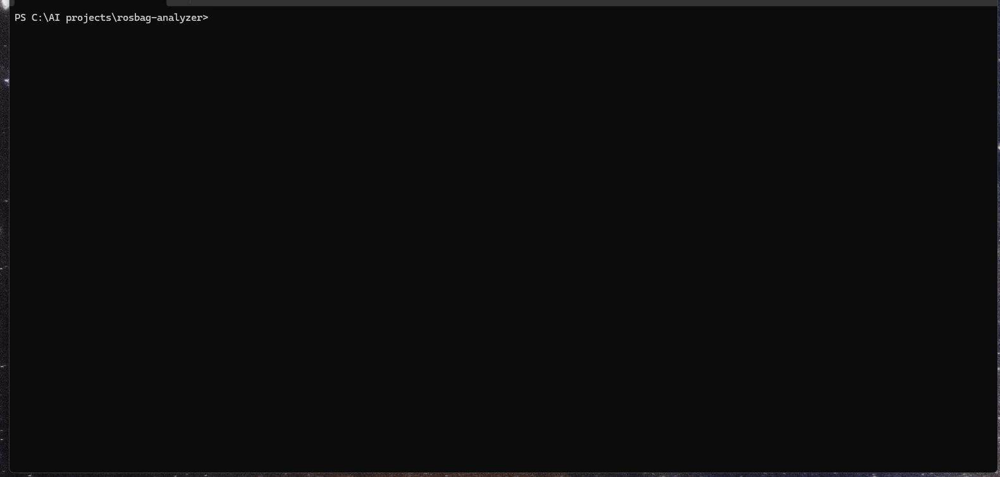

# RosBag Resurrector

**Stop letting your rosbag data rot. Analyze it.**

<p align="center">
  
</p>

A pandas-like data analysis tool for **ROS 2 (MCAP)** bag files — with automatic quality validation, multi-stream synchronization, ML-ready export, CLIP-powered semantic search, and a PlotJuggler-compatible WebSocket bridge.

**No ROS installation required.** Works on Linux, macOS, and Windows with just `pip install`.

> "We have terabytes of rosbag data and no good way to work with it after recording. Every time someone wants to analyze something, they write throwaway scripts to convert to CSV. Most bags never get analyzed at all."
>
> — [The Rosbag Graveyard](https://discourse.ros.org/), a shared frustration across the robotics community

## Install

### Python (recommended — works on Linux, macOS, Windows)

```bash
python -m venv .venv
source .venv/bin/activate          # Windows: .venv\Scripts\activate
pip install rosbag-resurrector
```

Requires Python 3.10+. No ROS required.

The venv step matters on macOS (Sonoma+) and recent Ubuntu/Debian, where a bare `pip install` outside a virtualenv fails with `error: externally-managed-environment` (PEP 668). If you already manage Python environments with `uv`, `pipx`, `poetry`, or conda, install with whatever you normally use — `pipx install rosbag-resurrector` is a good one-liner if you only need the CLI.

Optional extras unlock specific features (vision/CLIP, live ROS 2 bridge, additional export formats) — see [Optional Extras](#optional-extras) below.

### Standalone binaries

Pre-built single-file binaries are attached to every [GitHub release](https://github.com/vikramnagashoka/rosbag-resurrector/releases) — useful if you want to install without setting up Python at all.

**Ubuntu / Debian (`.deb`):**

```bash
curl -LO https://github.com/vikramnagashoka/rosbag-resurrector/releases/latest/download/rosbag-resurrector_amd64_latest.deb
sudo dpkg -i rosbag-resurrector_amd64_latest.deb
sudo apt-get install -f   # resolve any missing system libraries
```

The `_latest` filename always points to the newest release. For a specific version, browse the [releases page](https://github.com/vikramnagashoka/rosbag-resurrector/releases) and download the version-tagged `rosbag-resurrector_X.Y.Z_amd64.deb`.

**macOS (`.dmg`):**

```bash
curl -LO https://github.com/vikramnagashoka/rosbag-resurrector/releases/latest/download/RosBag-Resurrector-macos-latest.dmg
open RosBag-Resurrector-macos-latest.dmg
```

Drag the app to Applications. Same `_latest` filename pattern — the version-tagged `RosBag-Resurrector-vX.Y.Z-macos.dmg` is also attached to each release if you need to pin to a specific version.

> **Note:** the macOS binary isn't notarized yet, so on first launch you'll need to right-click → Open and confirm.

For repeated installs across many machines, `pip install rosbag-resurrector` is still the path of least resistance. The standalone binaries shine when you want a one-file deployable.

## First 10 minutes

Don't have a bag handy yet? You can explore the entire pipeline using a synthetic sample bag. Pick a path based on how you like to work.

### Step 1 — Verify your install (10 seconds)

```bash
resurrector doctor
```

Prints a pass / warn / fail grid for Python version, the MCAP parser, the DuckDB index path, optional vision/bridge dependencies, and dashboard configuration. Tells you exactly which features are ready to use with your current install.

### Step 2 — Generate a sample bag (5 seconds)

```bash
resurrector demo --full
```

Creates a 5-second synthetic MCAP at `~/.resurrector/demo_sample.mcap` with realistic IMU, joint-state, camera, and lidar data, then walks through scan → health → export so you can see end-to-end what the tool does.

Now pick the surface you'd actually use day-to-day:

### Path A — Web Dashboard (recommended for first-time)

```bash
resurrector dashboard
```

Open `http://localhost:8080` in your browser. You'll land on an empty Library page — paste the path from step 2 (`~/.resurrector/`) into the **Scan folder** input and click **Scan folder**. The demo bag appears with a health badge.

Click into the bag. From the Explorer page you can:
- **Plot tab** — pick a topic from the sidebar; the Plotly chart supports drag-to-zoom (server re-downsamples the narrower window) and click-to-annotate (notes persist across reloads)
- **Sync tab** — pick 2+ topics, choose a sync method, see them aligned in a table
- **Images tab** — automatically opens for image topics; scrub through frames with a slider
- **Export button** — opens the dialog for Parquet / HDF5 / CSV / NumPy / Zarr export

Other pages worth trying:
- **Search** — semantic frame search across all your indexed bags ("robot dropping object" → matching clips with thumbnails). Requires `pip install rosbag-resurrector[vision]` for the local CLIP backend, OR `[vision-openai]` for the OpenAI API backend
- **Datasets** — create versioned dataset collections for ML training pipelines
- **Bridge** — start a PlotJuggler-compatible WebSocket bridge from any bag in one click
- **Compare** — side-by-side topic / health comparison between two bags

### Path B — CLI

```bash
# scan a folder (also pre-builds video frame index for fast image access)
resurrector scan ~/.resurrector/

# quick visual summary with sparklines and grouped topics
resurrector quicklook ~/.resurrector/demo_sample.mcap

# detailed health report
resurrector health ~/.resurrector/demo_sample.mcap

# semantic search (after you've indexed frames)
resurrector index-frames ~/.resurrector/
resurrector search-frames "robot arm reaching"

# export to ML training format
resurrector export ~/.resurrector/demo_sample.mcap \
  --topics /imu/data /joint_states \
  --format parquet \
  --sync nearest \
  --output ./training_data/
```

Run `resurrector --help` for the full command list — see [CLI Reference](#cli-reference) below for details on each.

### Path C — Python / Jupyter

```python
from resurrector import BagFrame

# Load a bag (lazy — doesn't read all data into memory)
bf = BagFrame("~/.resurrector/demo_sample.mcap")

# Quick overview
bf.info()

# Get a topic as a Polars DataFrame
imu_df = bf["/imu/data"].to_polars()

# Or as Pandas
imu_pd = bf["/imu/data"].to_pandas()

# Stream large topics without OOM (chunked iterator)
for chunk in bf["/camera/rgb"].iter_chunks(chunk_size=10_000):
    process(chunk)

# Lazy frame for filter/projection pushdown — lifecycle is explicit
# (use as a context manager so the temp cache file is cleaned up).
with bf["/imu/data"].materialize_ipc_cache() as cache:
    filtered = (
        cache.scan()
        .filter(pl.col("linear_acceleration.x").abs() > 5.0)
        .collect()
    )

# Health report
report = bf.health_report()
print(f"Score: {report.score}/100")

# Synchronize multiple topics by timestamp
synced = bf.sync(["/imu/data", "/joint_states", "/camera/rgb"],
                 method="nearest", tolerance_ms=50)

# Export to ML-ready formats
bf.export(topics=["/imu/data", "/joint_states"],
          format="parquet", output="training_data/", sync=True)
```

In Jupyter, just display the `bf` object — it renders a rich HTML table with health badges and topic groups.

### Common gotchas

- **`mcap` module not found** — run `pip install -e ".[dev]"` if you cloned from source, or `pip install rosbag-resurrector` from PyPI
- **Dashboard scan returns 403** — by default, `RESURRECTOR_ALLOWED_ROOTS` defaults to your home directory. Set it (`os.pathsep`-separated) to broaden the scope
- **Semantic search returns nothing** — frames are only indexed for bags you ran `resurrector index-frames` on, OR if your bags were scanned with v0.2.2+ (which pre-builds the frame index during `scan`)
- **`.bag` or `.db3` raises NotImplementedError** — make sure `mcap` (for ROS 1) or `ros2` (for ROS 2 SQLite) is on your PATH; we shell out to them for auto-conversion

### Optional Extras

Install only what you need:

```bash
pip install rosbag-resurrector[vision]        # local CLIP semantic search (~2GB model)
pip install rosbag-resurrector[vision-openai] # OpenAI-backed semantic search (lighter)
pip install rosbag-resurrector[vision-lite]   # image/video parsing, no ML
pip install rosbag-resurrector[bridge-live]   # live ROS 2 topic bridge (requires rclpy)
pip install rosbag-resurrector[watch]         # auto-index new bags as they appear
pip install rosbag-resurrector[all-exports]   # Zarr, additional export formats
pip install rosbag-resurrector[ros1]          # ROS 1 .bag support via rosbags
```

Run `resurrector doctor` any time to see which extras are active.

## Try every feature in 30 seconds

The repo ships with **17 standalone exploration scripts** under [examples/](examples/) — one per major feature. They use a synthetic sample bag (auto-generated on first run) so you don't need your own data:

```bash
python examples/01_bag_frame_basics.py        # the pandas-like API
python examples/02_health_checks.py           # 0-100 quality score per bag
python examples/03_multi_stream_sync.py       # align topics with mismatched rates
python examples/04_image_video_export.py      # iterate frames, export MP4
python examples/05_ml_export_formats.py       # Parquet/HDF5/NumPy/LeRobot/RLDS
python examples/06_index_search_query_dsl.py  # DuckDB index + query DSL
python examples/07_semantic_frame_search.py   # CLIP semantic search
python examples/08_datasets_versioning.py     # versioned dataset collections
python examples/09_plotjuggler_bridge.py      # WebSocket bridge for live viz
```

Plus the v0.3.1 power features (`11_density_ribbon.py` through `18_polars_lazy_filter.py`) — bookmarks, math/transform editor, brush-to-trim export, cross-bag overlay, "Open in Jupyter", lazy Polars filter pushdown.

Each script:
- Runs in **under 10 seconds** end-to-end
- Auto-generates the demo bag on first run
- Auto-skips with install instructions when an optional extra (CLIP, OpenCV, etc.) isn't installed
- Has a one-line "what this is and why" header so you can decide whether to keep reading

Full index in [examples/README.md](examples/README.md). Running them in sequence also serves as a smoke-test suite — if all 17 pass on a fresh install, the toolkit is healthy.

## Features

### Automatic Health Checks

Every bag gets a quality score (0-100) detecting real-world problems:

- **Dropped messages** — catches the classic rosbag buffer overflow
- **Time gaps** — detects sensor disconnects and recording interruptions
- **Out-of-order timestamps** — flags clock sync issues
- **Partial topics** — topics that don't span the full recording
- **Message size anomalies** — sudden changes indicating corruption or config changes

```python
report = bf.health_report()
# Health Score: 87/100
# /lidar/points has 47 gaps > 200ms
# Recommendation: increase buffer size or reduce recording frequency
```

**Configurable thresholds** — every robot is different. Tune thresholds for your platform:

```python
from resurrector.ingest.health_check import HealthChecker, HealthConfig

config = HealthConfig(
    rate_drop_threshold=0.4,      # 40% drop before flagging (default: 25%)
    gap_multiplier=3.0,           # 3x expected period for gap detection (default: 2x)
    completeness_threshold=0.1,   # 10% start/end delay tolerance (default: 5%)
    size_deviation_threshold=0.8, # 80% size deviation tolerance (default: 50%)
)
checker = HealthChecker(config)
```

### Pandas-Like API

Work with robotics data the way you work with any tabular data:

```python
# Select topics
imu = bf["/imu/data"]
joints = bf["/joint_states"]

# Time slicing
segment = bf.time_slice("10s", "30s")

# Get as DataFrame with flattened columns
df = imu.to_polars()
# Columns: timestamp_ns, linear_acceleration.x, .y, .z,
#           angular_velocity.x, .y, .z, orientation.x, .y, .z, .w
```

### Jupyter Notebook Integration

BagFrame renders rich HTML tables in Jupyter with health badges, topic groups, and styled output:

```python
# In a Jupyter notebook cell, just display the object:
bf = BagFrame("experiment.mcap")
bf  # Renders interactive HTML table with health badges and topic groups
```

### Video & Image Support

Full support for both raw and compressed image topics:

```python
# Iterate frames from any image topic
for timestamp_ns, frame in bf["/camera/rgb"].iter_images():
    print(f"Frame at {timestamp_ns}: shape={frame.shape}")

# Works with compressed images too (JPEG/PNG)
for ts, frame in bf["/camera/compressed"].iter_images():
    process(frame)

# Export as frame sequence
bf["/camera/rgb"].is_image_topic  # True
```

**Export frames or video:**

```bash
# Export as numbered PNG files
resurrector export-frames experiment.mcap --topic /camera/rgb --output ./frames

# Export as MP4 video
resurrector export-frames experiment.mcap --topic /camera/rgb --video --output video.mp4 --fps 30
```

### Semantic Frame Search (CLIP-powered)

Search your bag collection by describing what's happening — no manual scrubbing:

```bash
# Index frames for semantic search
resurrector index-frames /path/to/bags/ --sample-hz 5

# Search by natural language
resurrector search-frames "robot fails to catch ball"
resurrector search-frames "gripper collision with table" --clips --clip-duration 5

# Save matching frames + metadata to disk
resurrector search-frames "robot arm reaching" --save ./results
```

Uses CLIP embeddings stored in DuckDB for fast cosine similarity search. Supports two backends:

```bash
# Option 1: Local CLIP (recommended, ~2GB model download)
pip install rosbag-resurrector[vision]

# Option 2: OpenAI API (lighter install, requires API key)
pip install rosbag-resurrector[vision-openai]

# Option 3: Just image parsing + video export, no ML
pip install rosbag-resurrector[vision-lite]
```

**Python API:**

```python
from resurrector.core.vision import FrameSearchEngine, CLIPEmbedder
from resurrector.ingest.indexer import BagIndex

index = BagIndex()
engine = FrameSearchEngine(index)

# Index a bag's image frames
engine.index_bag(bag_id=1, bag_path="experiment.mcap", sample_hz=5.0)

# Search by text
results = engine.search("robot drops the object", top_k=10)
for r in results:
    print(f"{r.bag_path} @ {r.timestamp_sec:.1f}s — similarity: {r.similarity:.3f}")

# Search for temporal clips
clips = engine.search_temporal("grasping attempt", clip_duration_sec=5.0)
for c in clips:
    print(f"{c.bag_path} [{c.start_sec:.1f}s - {c.end_sec:.1f}s] — {c.frame_count} frames")
```

### Resurrector Bridge (PlotJuggler-compatible WebSocket Streaming)

Stream bag data over WebSocket for real-time visualization — no DDS network config needed:

```bash
# Replay a bag at 2x speed — opens built-in web viewer automatically
resurrector bridge playback experiment.mcap --speed 2.0 --loop

# Connect PlotJuggler → WebSocket Client → ws://localhost:9090/ws

# Stream live ROS2 topics (requires rclpy)
resurrector bridge live --topic /imu/data --topic /joint_states
```

**Two modes:**
- **Playback** — replay recorded MCAP bags at configurable speed (0.1x–20x) with play/pause/seek
- **Live** — subscribe to real ROS2 topics via rclpy and relay over WebSocket

**PlotJuggler compatible** — uses the same flat JSON format PlotJuggler expects, so you can connect PlotJuggler's WebSocket client plugin directly. Also includes a built-in browser-based viewer with Plotly.js live plotting.

**REST API for playback control:**
```
POST /api/playback/play          Start/resume
POST /api/playback/pause         Pause
POST /api/playback/seek?t=5.0    Seek to timestamp
POST /api/playback/speed?v=2.0   Set speed
GET  /api/topics                 Discover available topics
GET  /api/status                 Playback state + progress
WS   /ws                        Data stream (PlotJuggler format)
```

### Multi-Stream Synchronization

Topics publish at independent rates. Resurrector aligns them:

```python
# Nearest-timestamp matching
synced = bf.sync(["/imu/data", "/joint_states"], method="nearest", tolerance_ms=50)

# Linear interpolation for numeric streams
synced = bf.sync(["/imu/data", "/joint_states"], method="interpolate")

# Sample-and-hold for slow topics
synced = bf.sync(["/imu/data", "/camera/rgb"], method="sample_and_hold")
```

### Reproducible Datasets

Create named, versioned dataset collections with full provenance tracking — the bridge between raw bags and ML training pipelines:

```python
from resurrector import DatasetManager, BagRef, SyncConfig, DatasetMetadata

mgr = DatasetManager()

# Create a dataset
mgr.create("pick-and-place-v1", description="Training data for manipulation")

# Add a version with specific bags, topics, and sync config
mgr.create_version(
    dataset_name="pick-and-place-v1",
    version="1.0",
    bag_refs=[
        BagRef(path="session_001.mcap", topics=["/imu/data", "/joint_states"]),
        BagRef(path="session_002.mcap", start_time="10s", end_time="60s"),
    ],
    sync_config=SyncConfig(method="nearest", tolerance_ms=25),
    export_format="parquet",
    downsample_hz=50,
    metadata=DatasetMetadata(
        description="6-DOF arm pick-and-place demonstrations",
        license="MIT",
        robot_type="UR5e",
        task="pick_and_place",
        tags=["manipulation", "imitation-learning"],
    ),
)

# Export — creates data files, manifest.json, dataset_config.json, and README.md
output = mgr.export_version("pick-and-place-v1", "1.0", output_dir="./datasets")
```

Each exported dataset includes:
- **manifest.json** — SHA256 hashes of every file for reproducibility
- **dataset_config.json** — full configuration for re-creating the dataset
- **README.md** — auto-generated documentation with sources, config, and a Python code snippet to load the data

### Smart Topic Grouping

Topics are automatically categorized into semantic groups for easier navigation:

```python
from resurrector.core.topic_groups import classify_topics

groups = classify_topics(bf.topic_names)
# [TopicGroup(name='Perception', topics=['/camera/rgb', '/lidar/scan']),
#  TopicGroup(name='State', topics=['/imu/data', '/joint_states']),
#  TopicGroup(name='Transforms', topics=['/tf', '/tf_static'])]
```

Built-in groups: **Perception**, **State**, **Navigation**, **Control**, **Transforms**, **Diagnostics**. Override with custom patterns:

```python
groups = classify_topics(bf.topic_names, custom_patterns={
    "MyRobot Sensors": ["/my_sensor", "/custom_lidar"],
})
```

### ML-Ready Export

Export directly to the formats your training pipeline expects:

```python
bf.export(topics=["/imu/data", "/joint_states"],
          format="parquet",    # Also: hdf5, csv, numpy, zarr, lerobot, rlds
          sync=True,
          downsample_hz=10)
```

Memory bounds vary by format — see [Performance contract](#performance-contract) for the precise rule. Parquet, HDF5, CSV, Zarr, and LeRobot are chunk-streamed (memory bounded by `chunk_size`, independent of topic size). NumPy `.npz` and RLDS accumulate per-topic and are bounded by total converted-array size; for very large topics, prefer Parquet.

| Format | Best For | Streaming |
|--------|----------|-----------|
| Parquet | Tabular sensor data, Spark/Polars pipelines | Chunk-streamed |
| HDF5 | Mixed numeric/image data, MATLAB compatibility | Chunk-streamed |
| CSV | Quick inspection, sharing with non-technical team members | Chunk-streamed |
| Zarr | Cloud-native, chunked, very large datasets | Chunk-streamed |
| **LeRobot** | Hugging Face LeRobot training (parquet + meta JSON) | Chunk-streamed |
| NumPy (.npz) | Jupyter notebook workflows | Bounded by total topic size — hard-capped at 1 M rows |
| **RLDS** | OpenX / RT-2 / robotic foundation models (TFRecord) | Chunk-streamed (v0.4.0+) |

LeRobot needs no extra deps. RLDS needs `tensorflow`: `pip install rosbag-resurrector[all-exports]`.

### Robotics Transforms

Common operations built in:

```python
from resurrector.core.transforms import quaternion_to_euler, add_euler_columns

# Add roll/pitch/yaw from quaternion columns
df = add_euler_columns(imu_df, prefix="orientation")

# Laser scan to Cartesian coordinates
from resurrector.core.transforms import laser_scan_to_cartesian
points = laser_scan_to_cartesian(ranges, angle_min, angle_max)

# Temporal downsampling
from resurrector.core.transforms import downsample_temporal
df_10hz = downsample_temporal(df, target_hz=10)
```

### Interactive Web Dashboard

```bash
resurrector dashboard --port 8080
```

Pages:

- **Library** — Browse, search, and filter all indexed bags. Header has a one-click "+ Scan folder" button + "Generate demo bag" so you can index data without leaving the page.
- **Explorer** — Plotly-based topic plots with brush-to-zoom, linked cursors, click-to-annotate. Tabs for plotting / multi-stream sync / image-video scrubbing. Side rails: bookmarks panel (right), topic list with density ribbon above the chart.
- **Search** — Semantic frame search by natural language ("robot drops object"); thumbnails link back to the matched frame in Explorer.
- **Datasets** — Full CRUD on versioned dataset collections with one-click export.
- **Compare** — Side-by-side topic / health comparison between two bags.
- **Compare runs** *(v0.3.1)* — Cross-bag overlay: pick 2+ bags + a topic, see them aligned on one chart with per-bag offset sliders, optional diff trace (B − A), and per-bag summary stats.
- **Bridge** — Start a PlotJuggler-compatible WebSocket bridge from any bag in one click; live status polling.
- **Health** — Visual quality reports with recommendations and per-topic scores.

Power features inside Explorer *(v0.3.1)*:

- **Bookmarks panel** — searchable annotations with click-to-jump, timeline-anchored, persists across sessions
- **Density ribbon** — heatmap above the chart showing per-topic message density across the full bag duration; click a column to jump there
- **Transform editor** — modal with a Common menu (derivative, integral, moving-average, low-pass, scale, abs, shift) plus a Polars expression escape hatch with sandboxed evaluation; preview live and "Add to plot" appends a new derived series
- **Trim & export** — three entry points (Select range button, current-zoom, manual sliders) → popover with format dropdown (MCAP / Parquet / CSV / HDF5 / NumPy / Zarr / MP4) and persistent output directory
- **Open in Jupyter** — exports the selected window as Parquet, copies a Polars `read_parquet(...)` snippet to your clipboard, opens `localhost:8888` if a Jupyter server is running

The scan endpoint supports **Server-Sent Events** for real-time progress streaming:

```
POST /api/scan?path=/data/bags&stream=true
```

Returns SSE events as bags are indexed, so the UI can show bags appearing in real-time.

### Searchable Index

DuckDB-powered index for fast queries across your entire bag collection:

```python
from resurrector import search

results = search("topic:/camera/rgb health:>80 after:2025-01")
```

**Stale index detection** — automatically detects when indexed bags have been moved or deleted:

```python
from resurrector.ingest.indexer import BagIndex

index = BagIndex()
stale = index.validate_paths()   # Find missing files
removed = index.remove_stale()   # Clean up stale entries
```

## CLI Reference

```bash
# Scan and index a directory
resurrector scan /path/to/bags/
resurrector scan /path/to/bags/ --verbose --log-file scan.log

# Quick summary with sparklines and grouped topics
resurrector quicklook experiment.mcap

# Show bag info
resurrector info experiment.mcap

# Health check
resurrector health experiment.mcap
resurrector health /path/to/bags/ --format json --output report.json

# List indexed bags with filtering
resurrector list --after 2025-01-01 --has-topic /camera/rgb --min-health 70

# Export
resurrector export experiment.mcap \
  --topics /imu/data /joint_states \
  --format parquet \
  --sync nearest \
  --output ./training_data/

# Compare two bags
resurrector diff bag1.mcap bag2.mcap

# Tag bags for organization
resurrector tag experiment.mcap --add "task:pick_and_place" "robot:digit"

# Watch a directory for new bags (auto-index on arrival)
resurrector watch /path/to/recording/dir/ --interval 5

# Dataset management
resurrector dataset create my-dataset --desc "Pick and place training"
resurrector dataset add-version my-dataset 1.0 \
  --bag session_001.mcap --bag session_002.mcap \
  --topic /imu/data --topic /joint_states \
  --format parquet
resurrector dataset export my-dataset 1.0 --output ./datasets
resurrector dataset list

# Launch web dashboard
resurrector dashboard --port 8080

# Bridge — stream bag data over WebSocket
resurrector bridge playback experiment.mcap --speed 2.0 --loop --port 9090
resurrector bridge live --topic /imu/data --port 9090
```

## Where Resurrector fits

Foxglove, PlotJuggler, and `rosbags` are all excellent at what they do. Resurrector isn't trying to displace them — it's a *bag-as-dataframe* analysis workbench, optimized for the parts those tools don't focus on:

- **Treat a bag like a Pandas DataFrame.** `bf["/imu/data"].to_polars()` and you're in your normal data-analysis flow. No protobuf, no ROS imports.
- **Health checks built in.** Catch dropped messages, rate drops, and gaps without writing a custom validator. Configurable thresholds.
- **Multi-stream sync.** `bf.sync(["/imu", "/joint_states"], method="nearest")` returns one aligned DataFrame.
- **ML-ready export.** Parquet, HDF5, CSV, Zarr, NumPy, plus first-class **LeRobot** and **RLDS** writers for Hugging Face / OpenX-style training pipelines.
- **Cross-bag overlay.** Compare the same topic across multiple bags on one chart — the kind of "did the new firmware change the gait?" workflow nobody else handles cleanly.
- **Memory bounds you can trust.** See [Performance contract](#performance-contract).
- **PlotJuggler-compatible WebSocket bridge.** When the ad-hoc analysis is done, hand the data straight to PlotJuggler for live plotting.

For interactive 3D scene viewing, TF tree visualization, marker rendering, and live ROS connection, **use Foxglove**. For super-fast OpenGL time-series plotting with millions of points, **use PlotJuggler**. For pure-Python rosbag1/rosbag2 read+write with custom message types, **use [rosbags](https://pypi.org/project/rosbags/)**.

A more honest comparison, narrowed to what Resurrector is built for:

| Capability | Resurrector | Foxglove | PlotJuggler | rosbags |
|---|---|---|---|---|
| DataFrame API on a bag (Polars/Pandas) | Yes | No | No | Partial |
| Built-in health checks (dropped msgs, rate drops, gaps) | Yes | No | No | No |
| Multi-stream timestamp sync | Yes (3 methods) | Visual only | Visual only | No |
| ML-export to LeRobot / RLDS | Yes | No | No | No |
| Cross-bag overlay (same topic, multiple bags) | Yes | No | No | No |
| Semantic frame search (CLIP) | Yes | No | No | No |
| Versioned dataset bundles | Yes | No | No | No |
| Bounded-memory streaming (per the [contract](#performance-contract)) | Yes | N/A | N/A | Partial |

## Supported Formats

Built ROS 2 first. MCAP is the modern ROS 2 default format (recommended since ROS 2 Iron) and the format we optimize for — self-describing, cross-platform, and readable without a ROS installation.

| Format | Extension | Status |
|--------|-----------|--------|
| **MCAP (ROS 2 default)** | `.mcap` | **Fully supported** — primary format |
| ROS 2 SQLite (single shard) | `.db3` | Auto-converted via `ros2 bag convert` |
| ROS 2 SQLite (directory bag) | dir with `metadata.yaml` | Recognized by scanner; auto-converted |
| ROS 1 bag | `.bag` | Auto-converted via `mcap convert` |

> **Note on legacy formats:** auto-conversion shells out to the official tools — `mcap convert` (Go binary, install via [mcap.dev/guides/cli](https://mcap.dev/guides/cli) or Homebrew/apt) for `.bag` files, and `ros2 bag convert` (ships with ROS 2) for `.db3`. Neither is bundled with the Python package because both are external binaries that pip can't ship. `resurrector doctor` will warn if either is missing — you only need the converter for the legacy format(s) you actually use.

## Architecture

```
resurrector/
  ingest/          # Scanner, parser, indexer, health checks
  core/            # BagFrame, sync, transforms, export, datasets, topic groups
  cli/             # Typer CLI with Rich formatting
  dashboard/       # FastAPI backend + React frontend
```

**Design principles:**
1. **Bounded memory** — see [Performance contract](#performance-contract) for the exact rule, enforced by tests
2. **Batteries included** — health checks, sync, transforms, export with zero config
3. **Escape hatches** — `.to_polars()` / `.to_pandas()` / `.to_numpy()` to drop into familiar tools
4. **ROS-aware but not ROS-dependent** — parses MCAP directly, no ROS installation needed
5. **Fast** — Polars for processing, DuckDB for queries, lazy evaluation
6. **Reproducible** — versioned datasets with manifests and auto-generated documentation

## Performance contract

> **Memory is bounded by the configured chunk size, not by bag size, topic size, or export size.**

That rule applies to: dashboard plotting, sync, health checks, density, cross-bag overlay, `iter_chunks()`, `materialize_ipc_cache()`, and the chunk-streaming export formats (Parquet, HDF5, CSV, Zarr, LeRobot, RLDS).

Two formats are explicit exceptions: **NumPy `.npz`** is bounded by total converted-array size and hard-capped at 1 M rows (use Parquet for larger topics — clear `LargeTopicError` is raised). The eager **`bf["/topic"].to_polars()`** path materializes the full topic and refuses topics > 1 M messages unless the user passes `force=True`.

The contract is verified by [tests/test_streaming_oom.py](tests/test_streaming_oom.py), which builds a 10 M-message synthetic bag and asserts peak RSS deltas across every workflow. Run it locally with `pytest -m slow`.

### Tuning the bounds

Every knob below has a sensible default. Override per-call when you need to — there is no global config file or environment variable.

| Knob | Default | Where it applies | When to change it |
|---|---|---|---|
| `chunk_size=` | `50_000` | `iter_chunks()`, `materialize_ipc_cache()`, `stream_bucketed_minmax()`, all chunk-streaming exporters | Lower for tighter RSS budgets on small machines; raise to reduce per-chunk overhead on fast NVMe |
| `max_buffer_messages=` | `100_000` | `bf.sync(engine="streaming")` per-topic lookahead buffer | Raise if a genuine rate mismatch trips `SyncBufferOverflowError`; lower to fail faster on misconfigured topics |
| `max_lateness_ms=` | `0.0` | `bf.sync(out_of_order="reorder")` watermark window | Set > 0 to admit late samples within the window when reordering. Ignored unless `out_of_order="reorder"` |
| `tolerance_ms=` | required arg | `bf.sync()` match window | Per-call — depends on your sensor rates |
| `engine=` | `"auto"` | `bf.sync()` engine selector | `"auto"` picks eager when every topic is < 1 M messages, streaming otherwise. Force one explicitly to override |
| `force=True` | `False` | `to_polars()`, `to_pandas()`, `to_numpy()` on a topic > 1 M messages | Escape hatch to materialize a large topic eagerly — you accept the RSS cost |

### Hard limits (not configurable)

These are constants the test suite verifies. There is no env var or config file to override them — by design, since they're the *contract*, not a tuning knob.

| Constant | Value | Behavior past the limit |
|---|---|---|
| `LARGE_TOPIC_THRESHOLD` | 1,000,000 messages | `to_polars()` / `to_pandas()` / `to_numpy()` raise `LargeTopicError` unless you pass `force=True`. Also the cutoff `engine="auto"` uses to pick streaming over eager in `bf.sync()` |
| `NUMPY_HARD_CAP` | 1,000,000 rows | NumPy `.npz` export refuses entirely (no `force=` escape) and raises `LargeTopicError` pointing at Parquet |

If you want to raise these on a big-RAM machine, the only options today are forking or monkey-patching the constants. A user-facing override is on the v0.5 wishlist.

## Development

```bash
git clone https://github.com/vikramnagashoka/rosbag-resurrector.git
cd rosbag-resurrector
pip install -e ".[dev]"

# Generate test bags
python tests/fixtures/generate_test_bags.py

# Run tests (348 tests, ~30 seconds)
pytest tests/ -v

# Build dashboard frontend
cd resurrector/dashboard/app
npm install && npm run build
```

### Test Coverage

| Test Suite | Tests | Covers |
|-----------|-------|--------|
| test_integration | 5 | Full pipeline: scan → index → health → sync → export |
| test_cli | 14 | All CLI commands including quicklook, watch, dataset |
| test_api | 13 | FastAPI endpoints: CRUD, health, sync, search, export |
| test_dataset | 14 | Dataset manager: create, version, export, manifest |
| test_bag_frame | 13 | BagFrame API, time slicing, conversions |
| test_ingest | 17 | Scanner, parser, indexer |
| test_sync | 6 | All 3 sync methods |
| test_health | 7 | Health checks, recommendations, caching |
| test_health_config | 5 | Configurable thresholds, edge cases |
| test_export | 8 | All export formats, downsampling |
| test_topic_groups | 12 | Topic classification, custom patterns |
| test_compressed_image | 7 | CompressedImage CDR parsing, decoding, iter_images |
| test_export_frames | 5 | PNG/JPEG sequences, MP4 video, subsampling |
| test_vision | 8 | FrameSampler, CLIPEmbedder, FrameSearchEngine (auto-skip) |
| test_bridge_protocol | 6 | PlotJuggler encoding, key format, list expansion |
| test_bridge_buffer | 7 | Ring buffer put/get, overflow, multi-consumer, threading |
| test_bridge_playback | 6 | Playback engine: play, pause, resume, speed, topic filter |
| test_bridge_server | 6 | REST API: topics, metadata, status, playback controls |

## Contributing

Contributions welcome! Key extension points:

- **New export formats**: Add a method to `resurrector/core/export.py`
- **New health checks**: Add a method to `resurrector/ingest/health_check.py`
- **New transforms**: Add to `resurrector/core/transforms.py`
- **New topic groups**: Add patterns to `resurrector/core/topic_groups.py`
- **ROS1 support**: Implement a `ROS1Parser` in `resurrector/ingest/parser.py`

## License

MIT
